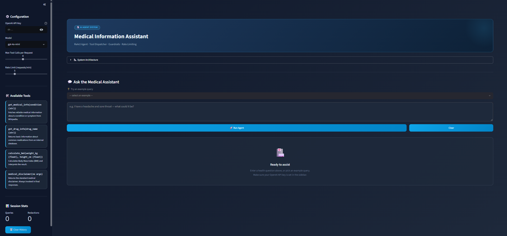

# 🩺 Medical Information Assistant

# 🤖 Multi-Agent Creative Story Building System

<p align="center">
  
</p>

---

An AI-powered Medical Information Assistant developed using **Python**, **Streamlit**, and the **OpenAI API**. The application provides users with reliable medical information through an intuitive conversational interface while incorporating guardrails and tool-based workflows to improve response quality and user safety.

---

## 📖 Overview

Medical Information Assistant is an intelligent chatbot that helps users obtain general medical information in a simple and interactive way. The application combines a modern Streamlit interface with OpenAI language models to answer health-related questions, provide BMI calculations, and retrieve basic medication and condition information.

> **Disclaimer:** This application is intended for educational and informational purposes only. It should not be used as a substitute for professional medical advice, diagnosis, or treatment.

---

## ✨ Features

* 🤖 AI-powered medical assistant
* 💬 Interactive chat interface
* 🩺 General medical information
* 💊 Medication information lookup
* ⚖️ BMI calculator
* 🛡️ Built-in safety guardrails
* ⚡ Fast and responsive Streamlit interface
* 🎯 Easy-to-use design

---

## 🛠 Technologies Used

* Python 3
* Streamlit
* OpenAI API
* Requests
* BeautifulSoup
* JSON

---

## 📂 Project Structure

```text
Medical-Information-Assistant/
│
├── app.py                 # Main application
├── requirements.txt       # Python dependencies
├── README.md              # Project documentation
├── .gitignore
├── Reference_Agent_System_Walkthrough_Guardrails.ipynb
│
├── assets/
│   └── Medical_AI.png
│
└── docs/
    └── Documentation.pdf
```

---

## 🚀 Installation

### Clone the repository

```bash
git clone https://github.com/maysamma/Medical-Information-Assistant.git
```

### Navigate to the project

```bash
cd Medical-Information-Assistant
```

### Create a virtual environment

```bash
python -m venv .venv
```

### Activate the virtual environment

Windows

```bash
.venv\Scripts\activate
```

Linux / macOS

```bash
source .venv/bin/activate
```

### Install dependencies

```bash
pip install -r requirements.txt
```

---

## 🔑 Environment Variables

Create a file named:

```text
.env
```

Add your OpenAI API key:

```env
OPENAI_API_KEY=your_api_key_here
```

---

## ▶️ Running the Application

Run the Streamlit application:

```bash
streamlit run app.py
```

After launching, the application will be available at:

```text
http://localhost:8501
```

---

## 📸 Application Preview

Create a folder named **assets** and place your application screenshot inside it:

```text
assets/
└── Medical_AI.png
```

Then the image will automatically appear here:

```markdown

```

---

## 💡 Example Use Cases

* Ask about common medical conditions.
* Learn basic information about medications.
* Calculate Body Mass Index (BMI).
* Receive educational health information.

---

## 🔒 Safety Notice

This assistant is designed to provide educational information only.

It does **not** replace licensed healthcare professionals.

Users should always consult qualified medical practitioners for diagnosis and treatment.

---

## 🔮 Future Improvements

* Conversation memory
* Medical image analysis
* Voice interaction
* Authentication system
* Medical knowledge database
* Multi-language support
* Patient profile management

---

## 👥 Development Team

This project was developed collaboratively by:

- Raghad Almutairi
- Ohoud Ibnalshaykh
- Maysam Abduljalil
- Hadi Asiri
- Bayan Alqarni
- Asma Alhadran

